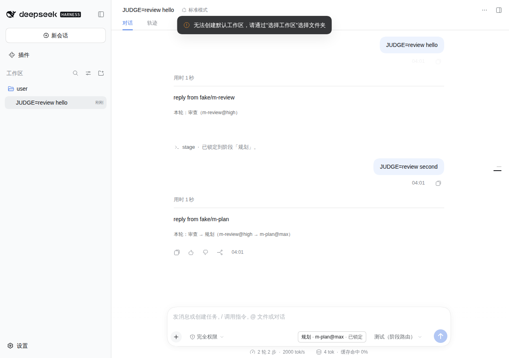

# 第 3 期：对话内展示与 `/stage` 命令

> 设计：`docs/superpowers/specs/2026-09-25-stage-router-design.md` §4「对话里的展示」
> **状态：已完成**。`pnpm test` 共 129 项全部通过（单元、客户端、集成）；`pnpm test:web` 用无头 Chromium 跑通了真实的 Web 端。



截图来自 `pnpm test:web`：假服务商 + 测试方案。截图里依次是：
- 第一轮由判断器分到审查阶段；
- 在面板里点「Plan」锁定；
- 第二轮直接走规划阶段的模型，没有调用判断器。

图中可以看到：
- 输入框右侧的阶段标签；
- 回复下方的每轮摘要；
- `/stage` 命令卡片；
- 模型选择器始终显示「测试（阶段路由）」。

## 做了什么

| 内容 | 文件 |
|---|---|
| `/stage` 命令：`/stage` 看状态、`/stage log` 看最近决策、`/stage <阶段>` 锁定、`/stage auto` 恢复自动、`/stage tier T<n> <档位\|auto>` 按任务改档 | `src/index.ts`、`src/shared/wire.ts` |
| 锁定和改档的持久化：直接折叠 dsh 自己写入的 `command/run` + `command/done` 事件，命令成功即持久化 | `src/engine/state.ts` |
| 按任务改档优先于规划者标签和判断器 | `src/engine/tiers.ts`、`src/engine/session-router.ts` |
| 决策记录：每个会话在内存里保留最近 50 条，供 `/stage log` 查看 | `src/engine/decisions.ts` |
| 投影补充：阶段名、阶段列表、每轮起止阶段和模型（最近 20 轮）、按任务改档表；`stateVersion` 升到 2 | `src/engine/state.ts` |
| 前后端共享的类型和 `/stage` 参数解析，不依赖任何后端代码 | `src/shared/wire.ts` |
| Web 端：输入框右侧的阶段标签和面板、每轮摘要、中文文案 | `src/client/*` |
| 客户端打包：CommonJS 单文件，用 `window.__ModuleLoader__.load` 包装，只 `require` 平台模块表里的模块 | `scripts/build-client.mjs`、`scripts/platform-modules.mjs` |
| 测试：组件测试（jsdom）、按宿主方式加载打包产物的测试、Web 端到端测试 | `test/client/*`、`test/e2e/web-ui.mjs` |

## 和设计不同的地方（已写回设计 §4、§9）

1. **没有做自定义远程服务。** 0.1.7 里外部插件没法把方法加进 dsh 的类型化远程接口。所以：
   - 面板上的操作通过 `ctx.remote.commands.execute(sessionId, '/stage …')` 执行，和 dsh 自带的计划模式开关（ui-plan）同一种做法。代价是每次操作会在对话里留下一张命令卡片。
   - 展示用的数据全部放进 `stage-router` 投影，由 dsh 推送给 Web 端。
   - 「试一试」需要调用判断器，放到第 4 期，届时用 `TypertRemoteService` 加 `connection.rpc.call` 的非类型化方式实现。
2. **客户端入口必须非常保守。** 客户端插件激活失败，会让整个 Web 端起不来。所以：
   - 顶层 `inject` 只写 `['slots', 'locale']`；
   - `remote.commands` 放在 `ctx.inject` 里按需获取；
   - 入口里任何地方都不抛异常。
3. **插槽是 `settings.plugins.tab`、`conversation.input.right`、`conversation.chat.turnTail`。** 组件通过 props 拿 `useProjection`；每轮摘要按 `turn.turn` 去查投影里的每轮记录。
4. **Web 端默认模型会话的选择器显示问题**（端到端测试发现）：会话没有明确选过模型时，第一轮之后选择器会显示路由到的真实模型。修正：本插件在第一次路由时写一条 `model/selection`（方案），把它记为这个会话的明确选择。这和选择器自己写的是同一种事件；只在存在 `modelSelection` 投影的地方写，也就是 Web 端。
5. **`pnpm test` 会先构建**，因为集成测试和打包产物测试加载的都是 `lib/` 里的文件。

## 本地复核（可选）

容器里已经用无头 Chromium 跑通了。如果想在自己的环境里看一眼：

```sh
pnpm install && pnpm build
dsh plugin --profile web add <本仓库路径>
dsh web
```

打开后在选择器里选 `研发默认 (stage-router)`，发几条消息，观察输入框右侧的标签和每轮摘要。这一步要调用真实的 DeepSeek 模型，需要配置 API key。

## 尚未覆盖

- 用真实模型时判断器的效果（提示词质量），只能在你的环境里观察。
- 按任务改档目前只有命令入口，面板里没有对应按钮。
- `/stage log` 的决策记录只保存在内存里，宿主进程重启后就没了（投影里仍保留当前阶段和最近一次判断）。
