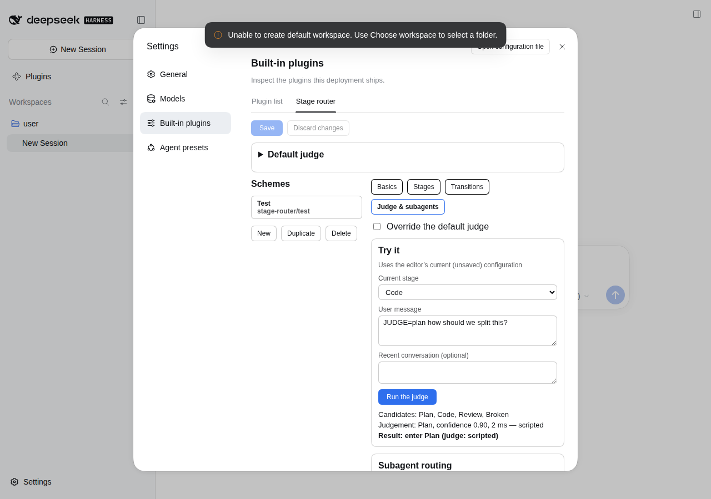

# 第 4 期：可视化编辑器与「试一试」

> 设计：`docs/superpowers/specs/2026-09-25-stage-router-design.md` §4「设置页编辑器」
> **状态：已完成**。`pnpm test` 共 166 项全部通过；`pnpm test:web:editor` 在无头 Chromium 里跑通了编辑、试一试、保存、实时生效的全流程。



入口：设置 → Built-in plugins（内置插件）→ Stage router 标签页。

## 做了什么

| 内容 | 文件 |
|---|---|
| 插件配置改成 volatile：dsh 设置服务只能读写 volatile 字段；保存后通过 `loader/volatile-update` 实时生效，不重启插件，各会话的路由状态保留 | `src/index.ts` |
| 编辑器的纯数据操作：增删和复制方案；增删、重命名、排序阶段（重命名时同步所有引用）；分档开关；转换规则；转换图的边；校验错误对应到字段 | `src/client/editor/model.ts` |
| 草稿校验（结构 + 语义 + 模型是否可用）和「试一试」 | `src/editor-service.ts` |
| 编辑器后端的各项操作：读配置、校验、保存（经设置服务写入 profile 层，带修订号）、试一试、模型目录 | `src/editor-handlers.ts` |
| 远程服务 `stageRouter/*`：`TypertRemoteService` + `@Remote`，走 dsh 网关的非类型化路径 | `src/editor-remote.ts` |
| 客户端调用：`connection.rpc.call('/api', 'stageRouter/<方法>', { args })` | `src/client/editor/api.ts` |
| 编辑器界面：默认判断器；方案列表；「基本 / 阶段 / 转换 / 判断器 & 子 agent」四个标签页；试一试 | `src/client/editor/*.tsx` |
| 测试：纯数据操作、后端操作、组件测试（jsdom）、打包产物测试、编辑器端到端测试 | `test/client/*`、`test/editor-*.spec.ts`、`test/e2e/web-editor.mjs` |

## 和设计不同的地方（已写回设计 §4、§9）

1. **配置必须是 volatile。** 0.1.7 的设置服务只认 `.volatile()` 字段；不标的话，这一行配置对设置系统完全不可见。所以：
   - 插件对外的 `Config` 把 `defaultJudge` 和 `schemes` 标成 volatile；
   - 内部校验和编辑器继续用普通的 `ConfigSchema`；
   - 运行时读取的是配置快照。
2. **保存经设置服务写入。** 后端用 `ctx.settings.replace('stage-router', config, revision)` 保存，写入 `$DSH_HOME/profiles/<profile>/cordis.patch.yml` 里本插件那一行，写之前会按插件的 `Config` 校验。修订号用来发现并发修改；有冲突时报 `stage-router/rejected`。
3. **保存时哪些问题会阻止保存。** 结构错误会阻止，包括重复 ID、引用了不存在的阶段、没选模型。「模型当前不可用」只作为提醒，不阻止保存，因为模型可能只是暂时没有凭据。
4. **排序用上移 / 下移按钮**，没有做拖动，更稳也更好测。
5. **后端操作和远程服务分成两个文件。** Vitest 4 不会转换 TC39 装饰器，所以纯逻辑放在 `editor-handlers.ts`，装饰器只出现在 `editor-remote.ts`（由 tsc 编译）。冒烟测试改为直接加载 `lib/index.js`。
6. **客户端包体积。** 事件枚举等常量单独放进 `src/config/constants.ts`，客户端不再打包 schemastery。目前客户端包约 74KB（未压缩），运行时只 `require` react 和 react/jsx-runtime。

## 本地复核（可选）

```sh
pnpm install && pnpm build
dsh plugin --profile web add <本仓库路径>
dsh web
```

打开 设置 → Built-in plugins → Stage router：
- 下拉框里应该能看到你配置过的 DeepSeek 模型；
- 在「试一试」里输入一句话，看判断器的选择和置信度；
- 保存后，模型选择器里的方案名会立即更新。

## 尚未覆盖

- 编辑器里还不能从已有模型一键生成方案，也不能导入或导出 YAML。
- 在 Web 端以外修改配置文件（例如手工编辑 `cordis.patch.yml`）时，编辑器需要重新打开才能看到最新配置。
- 真实模型下判断器的提示词质量，只能在你的环境里观察。
